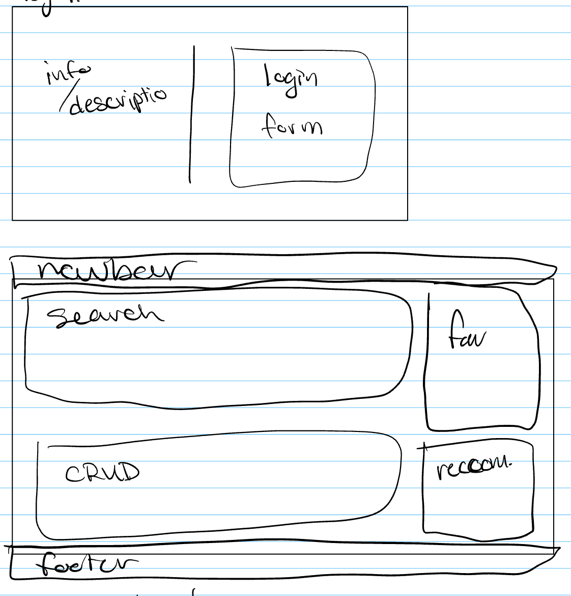
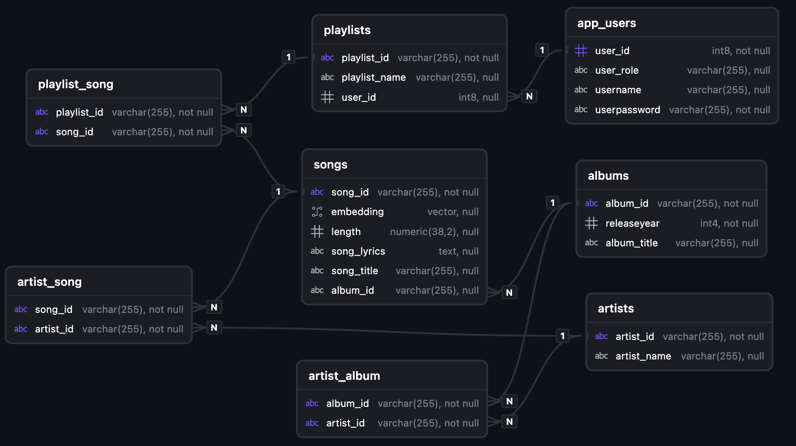

# SongSearcher

SongSearcher is for those who want to explore new music. Rather than traditional searching through similar genre's and artists, SongSearcher AI algorithm can determine similar songs through the lyrics. This AI Similarity looks deeper than just the words, it understands the vibe and meaning that a typical lexical search (exact word to word matching) will miss. 

SongSearcher's Dashboard allows users to sift through our database, to find songs that they already like and enjoy. Users can add these songs to their favorites playlist, where they will see custom song recommendations based on their favorite songs! Additionally, users can take a closer look at a song by clicking on it and see similar songs for that particular one. 

SongSearcher currently emodies [these user stories](./Documentation/UserStories.md). 

## Wireframe



## Entity Relation Diagram (ERD) for Postgres Database



## API Endpoint Documentation (JSON)

Visit http://localhost:8080/swagger-ui.html with SongSearcherBackend running for a visually appealing UI of the endpoint documentation. 

```
{
  "openapi": "3.0.1",
  "info": {
    "title": "OpenAPI definition",
    "version": "v0"
  },
  "servers": [
    {
      "url": "http://localhost:8080",
      "description": "Generated server url"
    }
  ],
  "paths": {
    "/api/playlists/{id}": {
      "get": {
        "tags": [
          "playlist-controller"
        ],
        "operationId": "getById_1",
        "parameters": [
          {
            "name": "id",
            "in": "path",
            "required": true,
            "schema": {
              "type": "string"
            }
          }
        ],
        "responses": {
          "200": {
            "description": "OK",
            "content": {
              "*/*": {
                "schema": {
                  "$ref": "#/components/schemas/PlaylistDTO"
                }
              }
            }
          }
        }
      },
      "put": {
        "tags": [
          "playlist-controller"
        ],
        "operationId": "update",
        "parameters": [
          {
            "name": "id",
            "in": "path",
            "required": true,
            "schema": {
              "type": "string"
            }
          }
        ],
        "requestBody": {
          "content": {
            "application/json": {
              "schema": {
                "$ref": "#/components/schemas/PlaylistDTO"
              }
            }
          },
          "required": true
        },
        "responses": {
          "200": {
            "description": "OK",
            "content": {
              "*/*": {
                "schema": {
                  "$ref": "#/components/schemas/PlaylistDTO"
                }
              }
            }
          }
        }
      },
      "delete": {
        "tags": [
          "playlist-controller"
        ],
        "operationId": "delete_1",
        "parameters": [
          {
            "name": "id",
            "in": "path",
            "required": true,
            "schema": {
              "type": "string"
            }
          }
        ],
        "responses": {
          "200": {
            "description": "OK"
          }
        }
      },
      "patch": {
        "tags": [
          "playlist-controller"
        ],
        "operationId": "patch_1",
        "parameters": [
          {
            "name": "id",
            "in": "path",
            "required": true,
            "schema": {
              "type": "string"
            }
          }
        ],
        "requestBody": {
          "content": {
            "application/json": {
              "schema": {
                "$ref": "#/components/schemas/PlaylistDTO"
              }
            }
          },
          "required": true
        },
        "responses": {
          "200": {
            "description": "OK",
            "content": {
              "*/*": {
                "schema": {
                  "$ref": "#/components/schemas/PlaylistDTO"
                }
              }
            }
          }
        }
      }
    },
    "/api/songs": {
      "get": {
        "tags": [
          "song-controller"
        ],
        "operationId": "getAll",
        "responses": {
          "200": {
            "description": "OK",
            "content": {
              "*/*": {
                "schema": {
                  "type": "array",
                  "items": {
                    "$ref": "#/components/schemas/SongDTO"
                  }
                }
              }
            }
          }
        }
      },
      "post": {
        "tags": [
          "song-controller"
        ],
        "operationId": "create",
        "requestBody": {
          "content": {
            "application/json": {
              "schema": {
                "$ref": "#/components/schemas/SongWOIDDTO"
              }
            }
          },
          "required": true
        },
        "responses": {
          "200": {
            "description": "OK",
            "content": {
              "*/*": {
                "schema": {
                  "$ref": "#/components/schemas/SongDTO"
                }
              }
            }
          }
        }
      }
    },
    "/api/songs/search/similar": {
      "post": {
        "tags": [
          "song-controller"
        ],
        "operationId": "searchByLyrics",
        "requestBody": {
          "content": {
            "application/json": {
              "schema": {
                "$ref": "#/components/schemas/SearchDTO"
              }
            }
          },
          "required": true
        },
        "responses": {
          "200": {
            "description": "OK",
            "content": {
              "*/*": {
                "schema": {
                  "type": "array",
                  "items": {
                    "$ref": "#/components/schemas/SongDTO"
                  }
                }
              }
            }
          }
        }
      }
    },
    "/api/playlists": {
      "get": {
        "tags": [
          "playlist-controller"
        ],
        "operationId": "getAll_1",
        "responses": {
          "200": {
            "description": "OK",
            "content": {
              "*/*": {
                "schema": {
                  "type": "array",
                  "items": {
                    "$ref": "#/components/schemas/PlaylistDTO"
                  }
                }
              }
            }
          }
        }
      },
      "post": {
        "tags": [
          "playlist-controller"
        ],
        "operationId": "create_1",
        "requestBody": {
          "content": {
            "application/json": {
              "schema": {
                "$ref": "#/components/schemas/PlaylistWOIDDTO"
              }
            }
          },
          "required": true
        },
        "responses": {
          "200": {
            "description": "OK",
            "content": {
              "*/*": {
                "schema": {
                  "$ref": "#/components/schemas/PlaylistDTO"
                }
              }
            }
          }
        }
      }
    },
    "/api/playlists/removeSong/{playlistId}": {
      "post": {
        "tags": [
          "playlist-controller"
        ],
        "operationId": "removeSongFromPlaylist",
        "parameters": [
          {
            "name": "playlistId",
            "in": "path",
            "required": true,
            "schema": {
              "type": "string"
            }
          }
        ],
        "requestBody": {
          "content": {
            "application/json": {
              "schema": {
                "$ref": "#/components/schemas/SongID"
              }
            }
          },
          "required": true
        },
        "responses": {
          "200": {
            "description": "OK",
            "content": {
              "*/*": {
                "schema": {
                  "$ref": "#/components/schemas/PlaylistDTO"
                }
              }
            }
          }
        }
      }
    },
    "/api/playlists/addSong/{playlistId}": {
      "post": {
        "tags": [
          "playlist-controller"
        ],
        "operationId": "addSongToPlaylist",
        "parameters": [
          {
            "name": "playlistId",
            "in": "path",
            "required": true,
            "schema": {
              "type": "string"
            }
          }
        ],
        "requestBody": {
          "content": {
            "application/json": {
              "schema": {
                "$ref": "#/components/schemas/SongID"
              }
            }
          },
          "required": true
        },
        "responses": {
          "200": {
            "description": "OK",
            "content": {
              "*/*": {
                "schema": {
                  "$ref": "#/components/schemas/PlaylistDTO"
                }
              }
            }
          }
        }
      }
    },
    "/api/auth/register": {
      "post": {
        "tags": [
          "auth-controller"
        ],
        "operationId": "register",
        "requestBody": {
          "content": {
            "application/json": {
              "schema": {
                "$ref": "#/components/schemas/AppUserWOIDDTO"
              }
            }
          },
          "required": true
        },
        "responses": {
          "200": {
            "description": "OK",
            "content": {
              "*/*": {
                "schema": {
                  "$ref": "#/components/schemas/AuthResponse"
                }
              }
            }
          }
        }
      }
    },
    "/api/auth/login": {
      "post": {
        "tags": [
          "auth-controller"
        ],
        "operationId": "login",
        "requestBody": {
          "content": {
            "application/json": {
              "schema": {
                "$ref": "#/components/schemas/AuthRequest"
              }
            }
          },
          "required": true
        },
        "responses": {
          "200": {
            "description": "OK",
            "content": {
              "*/*": {
                "schema": {
                  "$ref": "#/components/schemas/AuthResponse"
                }
              }
            }
          }
        }
      }
    },
    "/api/artists": {
      "get": {
        "tags": [
          "artist-controller"
        ],
        "operationId": "getAll_2",
        "responses": {
          "200": {
            "description": "OK",
            "content": {
              "*/*": {
                "schema": {
                  "type": "array",
                  "items": {
                    "$ref": "#/components/schemas/ArtistDTO"
                  }
                }
              }
            }
          }
        }
      },
      "post": {
        "tags": [
          "artist-controller"
        ],
        "operationId": "create_2",
        "requestBody": {
          "content": {
            "application/json": {
              "schema": {
                "$ref": "#/components/schemas/ArtistWOIDDTO"
              }
            }
          },
          "required": true
        },
        "responses": {
          "200": {
            "description": "OK",
            "content": {
              "*/*": {
                "schema": {
                  "$ref": "#/components/schemas/ArtistDTO"
                }
              }
            }
          }
        }
      }
    },
    "/api/albums": {
      "get": {
        "tags": [
          "album-controller"
        ],
        "operationId": "getAll_3",
        "responses": {
          "200": {
            "description": "OK",
            "content": {
              "*/*": {
                "schema": {
                  "type": "array",
                  "items": {
                    "$ref": "#/components/schemas/AlbumDTO"
                  }
                }
              }
            }
          }
        }
      },
      "post": {
        "tags": [
          "album-controller"
        ],
        "operationId": "create_3",
        "requestBody": {
          "content": {
            "application/json": {
              "schema": {
                "$ref": "#/components/schemas/AlbumWOIDDTO"
              }
            }
          },
          "required": true
        },
        "responses": {
          "200": {
            "description": "OK",
            "content": {
              "*/*": {
                "schema": {
                  "$ref": "#/components/schemas/AlbumDTO"
                }
              }
            }
          }
        }
      }
    },
    "/api/songs/{id}": {
      "get": {
        "tags": [
          "song-controller"
        ],
        "operationId": "getById",
        "parameters": [
          {
            "name": "id",
            "in": "path",
            "required": true,
            "schema": {
              "type": "string"
            }
          }
        ],
        "responses": {
          "200": {
            "description": "OK",
            "content": {
              "*/*": {
                "schema": {
                  "$ref": "#/components/schemas/SongDTO"
                }
              }
            }
          }
        }
      },
      "delete": {
        "tags": [
          "song-controller"
        ],
        "operationId": "delete",
        "parameters": [
          {
            "name": "id",
            "in": "path",
            "required": true,
            "schema": {
              "type": "string"
            }
          }
        ],
        "responses": {
          "200": {
            "description": "OK"
          }
        }
      },
      "patch": {
        "tags": [
          "song-controller"
        ],
        "operationId": "patch",
        "parameters": [
          {
            "name": "id",
            "in": "path",
            "required": true,
            "schema": {
              "type": "string"
            }
          }
        ],
        "requestBody": {
          "content": {
            "application/json": {
              "schema": {
                "$ref": "#/components/schemas/SongDTO"
              }
            }
          },
          "required": true
        },
        "responses": {
          "200": {
            "description": "OK",
            "content": {
              "*/*": {
                "schema": {
                  "$ref": "#/components/schemas/SongDTO"
                }
              }
            }
          }
        }
      }
    },
    "/api/artists/{id}": {
      "get": {
        "tags": [
          "artist-controller"
        ],
        "operationId": "getById_2",
        "parameters": [
          {
            "name": "id",
            "in": "path",
            "required": true,
            "schema": {
              "type": "string"
            }
          }
        ],
        "responses": {
          "200": {
            "description": "OK",
            "content": {
              "*/*": {
                "schema": {
                  "$ref": "#/components/schemas/ArtistDTO"
                }
              }
            }
          }
        }
      },
      "delete": {
        "tags": [
          "artist-controller"
        ],
        "operationId": "delete_2",
        "parameters": [
          {
            "name": "id",
            "in": "path",
            "required": true,
            "schema": {
              "type": "string"
            }
          }
        ],
        "responses": {
          "200": {
            "description": "OK"
          }
        }
      },
      "patch": {
        "tags": [
          "artist-controller"
        ],
        "operationId": "patch_2",
        "parameters": [
          {
            "name": "id",
            "in": "path",
            "required": true,
            "schema": {
              "type": "string"
            }
          }
        ],
        "requestBody": {
          "content": {
            "application/json": {
              "schema": {
                "$ref": "#/components/schemas/ArtistDTO"
              }
            }
          },
          "required": true
        },
        "responses": {
          "200": {
            "description": "OK",
            "content": {
              "*/*": {
                "schema": {
                  "$ref": "#/components/schemas/ArtistDTO"
                }
              }
            }
          }
        }
      }
    },
    "/api/albums/{id}": {
      "get": {
        "tags": [
          "album-controller"
        ],
        "operationId": "getById_3",
        "parameters": [
          {
            "name": "id",
            "in": "path",
            "required": true,
            "schema": {
              "type": "string"
            }
          }
        ],
        "responses": {
          "200": {
            "description": "OK",
            "content": {
              "*/*": {
                "schema": {
                  "$ref": "#/components/schemas/AlbumDTO"
                }
              }
            }
          }
        }
      },
      "delete": {
        "tags": [
          "album-controller"
        ],
        "operationId": "delete_3",
        "parameters": [
          {
            "name": "id",
            "in": "path",
            "required": true,
            "schema": {
              "type": "string"
            }
          }
        ],
        "responses": {
          "200": {
            "description": "OK"
          }
        }
      },
      "patch": {
        "tags": [
          "album-controller"
        ],
        "operationId": "patch_3",
        "parameters": [
          {
            "name": "id",
            "in": "path",
            "required": true,
            "schema": {
              "type": "string"
            }
          }
        ],
        "requestBody": {
          "content": {
            "application/json": {
              "schema": {
                "$ref": "#/components/schemas/AlbumDTO"
              }
            }
          },
          "required": true
        },
        "responses": {
          "200": {
            "description": "OK",
            "content": {
              "*/*": {
                "schema": {
                  "$ref": "#/components/schemas/AlbumDTO"
                }
              }
            }
          }
        }
      }
    },
    "/api/songs/search/title/{title}": {
      "get": {
        "tags": [
          "song-controller"
        ],
        "operationId": "searchTitle",
        "parameters": [
          {
            "name": "title",
            "in": "path",
            "required": true,
            "schema": {
              "type": "string"
            }
          }
        ],
        "responses": {
          "200": {
            "description": "OK",
            "content": {
              "*/*": {
                "schema": {
                  "type": "array",
                  "items": {
                    "$ref": "#/components/schemas/SongDTO"
                  }
                }
              }
            }
          }
        }
      }
    },
    "/api/songs/search/similar/{id}": {
      "get": {
        "tags": [
          "song-controller"
        ],
        "operationId": "similarSearchById",
        "parameters": [
          {
            "name": "id",
            "in": "path",
            "required": true,
            "schema": {
              "type": "string"
            }
          }
        ],
        "responses": {
          "200": {
            "description": "OK",
            "content": {
              "*/*": {
                "schema": {
                  "type": "array",
                  "items": {
                    "$ref": "#/components/schemas/SongDTO"
                  }
                }
              }
            }
          }
        }
      }
    },
    "/api/songs/search/artist/{name}": {
      "get": {
        "tags": [
          "song-controller"
        ],
        "operationId": "searchArtist",
        "parameters": [
          {
            "name": "name",
            "in": "path",
            "required": true,
            "schema": {
              "type": "string"
            }
          }
        ],
        "responses": {
          "200": {
            "description": "OK",
            "content": {
              "*/*": {
                "schema": {
                  "type": "array",
                  "items": {
                    "$ref": "#/components/schemas/SongDTO"
                  }
                }
              }
            }
          }
        }
      }
    },
    "/api/songs/search/album/{title}": {
      "get": {
        "tags": [
          "song-controller"
        ],
        "operationId": "searchAlbum",
        "parameters": [
          {
            "name": "title",
            "in": "path",
            "required": true,
            "schema": {
              "type": "string"
            }
          }
        ],
        "responses": {
          "200": {
            "description": "OK",
            "content": {
              "*/*": {
                "schema": {
                  "type": "array",
                  "items": {
                    "$ref": "#/components/schemas/SongDTO"
                  }
                }
              }
            }
          }
        }
      }
    },
    "/api/songs/recommend": {
      "get": {
        "tags": [
          "song-controller"
        ],
        "operationId": "getUserSongRecommendations",
        "responses": {
          "200": {
            "description": "OK",
            "content": {
              "*/*": {
                "schema": {
                  "type": "array",
                  "items": {
                    "$ref": "#/components/schemas/SongDTO"
                  }
                }
              }
            }
          }
        }
      }
    },
    "/api/playlists/user": {
      "get": {
        "tags": [
          "playlist-controller"
        ],
        "operationId": "getByUserId",
        "responses": {
          "200": {
            "description": "OK",
            "content": {
              "*/*": {
                "schema": {
                  "type": "array",
                  "items": {
                    "$ref": "#/components/schemas/PlaylistDTO"
                  }
                }
              }
            }
          }
        }
      }
    }
  },
  "components": {
    "schemas": {
      "AlbumSlimDTO": {
        "required": [
          "id",
          "releaseYear",
          "title"
        ],
        "type": "object",
        "properties": {
          "id": {
            "type": "string"
          },
          "title": {
            "type": "string"
          },
          "releaseYear": {
            "type": "integer",
            "format": "int32"
          }
        }
      },
      "ArtistDTO": {
        "required": [
          "id",
          "name"
        ],
        "type": "object",
        "properties": {
          "id": {
            "type": "string"
          },
          "name": {
            "type": "string"
          }
        }
      },
      "PlaylistDTO": {
        "required": [
          "id",
          "name",
          "userid"
        ],
        "type": "object",
        "properties": {
          "id": {
            "type": "string"
          },
          "name": {
            "type": "string"
          },
          "userid": {
            "type": "integer",
            "format": "int64"
          },
          "songs": {
            "uniqueItems": true,
            "type": "array",
            "items": {
              "$ref": "#/components/schemas/SongDTO"
            }
          }
        }
      },
      "SongDTO": {
        "required": [
          "album",
          "id",
          "length",
          "lyrics",
          "title"
        ],
        "type": "object",
        "properties": {
          "id": {
            "type": "string"
          },
          "title": {
            "type": "string"
          },
          "length": {
            "type": "number"
          },
          "lyrics": {
            "type": "string"
          },
          "album": {
            "$ref": "#/components/schemas/AlbumSlimDTO"
          },
          "artists": {
            "type": "array",
            "items": {
              "$ref": "#/components/schemas/ArtistDTO"
            }
          }
        }
      },
      "SongWOIDDTO": {
        "required": [
          "album",
          "length",
          "lyrics",
          "title"
        ],
        "type": "object",
        "properties": {
          "title": {
            "type": "string"
          },
          "length": {
            "type": "number"
          },
          "lyrics": {
            "type": "string"
          },
          "album": {
            "$ref": "#/components/schemas/AlbumSlimDTO"
          },
          "artists": {
            "type": "array",
            "items": {
              "$ref": "#/components/schemas/ArtistDTO"
            }
          }
        }
      },
      "SearchDTO": {
        "required": [
          "lyrics"
        ],
        "type": "object",
        "properties": {
          "lyrics": {
            "type": "string"
          }
        }
      },
      "PlaylistWOIDDTO": {
        "required": [
          "name"
        ],
        "type": "object",
        "properties": {
          "name": {
            "type": "string"
          },
          "songs": {
            "uniqueItems": true,
            "type": "array",
            "items": {
              "$ref": "#/components/schemas/SongDTO"
            }
          }
        }
      },
      "SongID": {
        "required": [
          "song_id"
        ],
        "type": "object",
        "properties": {
          "song_id": {
            "type": "string"
          }
        }
      },
      "AppUserWOIDDTO": {
        "required": [
          "password",
          "username"
        ],
        "type": "object",
        "properties": {
          "username": {
            "type": "string"
          },
          "password": {
            "type": "string"
          }
        }
      },
      "AuthResponse": {
        "type": "object",
        "properties": {
          "token": {
            "type": "string"
          }
        }
      },
      "AuthRequest": {
        "type": "object",
        "properties": {
          "username": {
            "type": "string"
          },
          "password": {
            "type": "string"
          }
        }
      },
      "ArtistWOIDDTO": {
        "required": [
          "name"
        ],
        "type": "object",
        "properties": {
          "name": {
            "type": "string"
          }
        }
      },
      "AlbumWOIDDTO": {
        "required": [
          "artists",
          "releaseYear",
          "title"
        ],
        "type": "object",
        "properties": {
          "title": {
            "type": "string"
          },
          "releaseYear": {
            "type": "integer",
            "format": "int32"
          },
          "artists": {
            "type": "array",
            "items": {
              "$ref": "#/components/schemas/ArtistDTO"
            }
          }
        }
      },
      "AlbumDTO": {
        "required": [
          "artists",
          "id",
          "releaseYear",
          "title"
        ],
        "type": "object",
        "properties": {
          "id": {
            "type": "string"
          },
          "title": {
            "type": "string"
          },
          "releaseYear": {
            "type": "integer",
            "format": "int32"
          },
          "artists": {
            "type": "array",
            "items": {
              "$ref": "#/components/schemas/ArtistDTO"
            }
          }
        }
      }
    }
  }
}